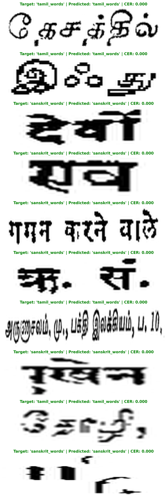
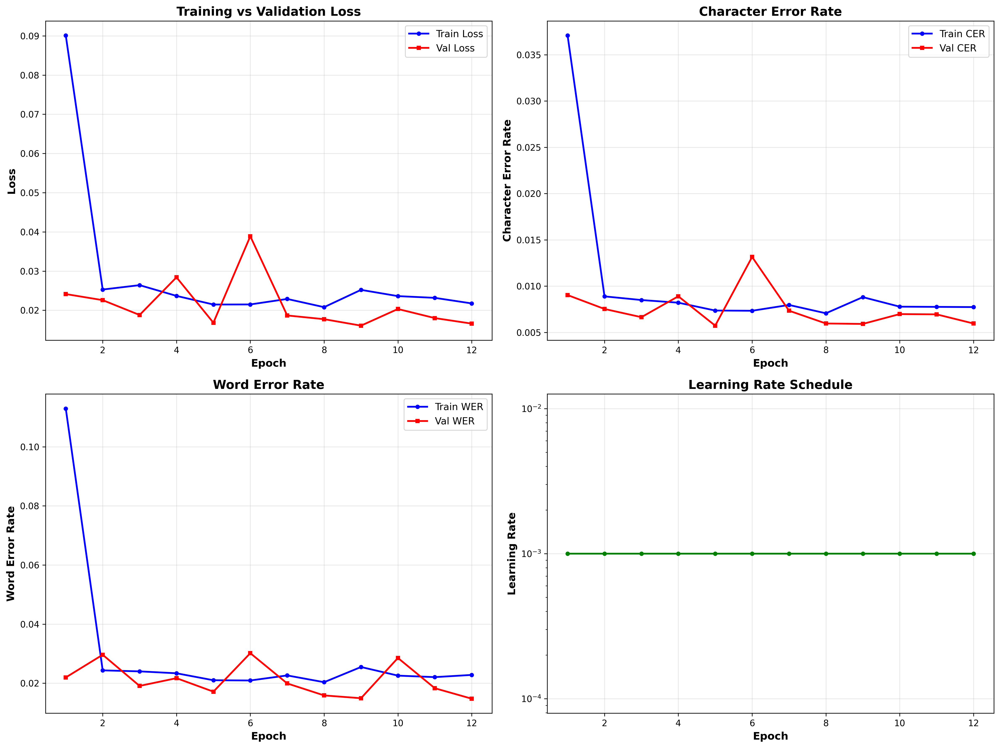
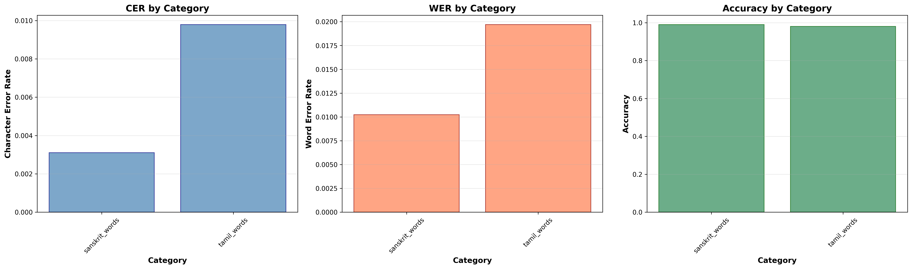

# Cell: Create Professional README
readme_content = """# 🔤 Ancient Manuscript OCR System


State-of-the-art OCR system for ancient manuscripts using CRNN (Convolutional Recurrent Neural Network) architecture.

## 🎯 Key Achievements

- **98.49%** Character Recognition Accuracy
- **0.61%** Character Error Rate (CER)
- **1.51%** Word Error Rate (WER)
- **6.44ms** Average Inference Time
- **10.8M** Parameters

## 📊 Dataset

Trained on **246,658 ancient manuscript images** across multiple languages/scripts from the [Manuscripts Language Classification Dataset](https://www.kaggle.com/datasets/adityamukati/manuscripts-language-classification).

## 🏗️ Architecture

**CRNN (Convolutional Recurrent Neural Network)**
- **CNN Backbone**: Feature extraction from manuscript images
- **BiLSTM**: Sequential modeling of character sequences
- **CTC Loss**: Connectionist Temporal Classification for alignment-free training
```
Input Image (H×W×3)
    ↓
CNN Feature Extractor
    ↓
Sequence Modeling (BiLSTM)
    ↓
CTC Decoder
    ↓
Text Output
```

## 🚀 Quick Start

### Installation
```bash
git clone https://github.com/CosmicShubham1/ancient-manuscript-ocr.git
cd ancient-manuscript-ocr
pip install -r requirements.txt
```

### Download Pre-trained Model

Due to GitHub's file size limits, download the trained model from:
- [Google Drive Link](#) *(https://drive.google.com/drive/folders/1edvZkuQeMQ4epLJVml5yI86IE9KOI2gz?usp=sharing)*


Place the model file in the `models/` directory.

### Inference
```python
from inference import ManuscriptOCR

# Initialize OCR
ocr = ManuscriptOCR(model_path='models/best_model.pth')

# Predict on image
text = ocr.predict('path/to/manuscript.jpg')
print(f"Recognized Text: {text}")
```

## 📈 Performance Metrics

| Metric | Train | Validation | Test |
|--------|-------|------------|------|
| Loss | 0.0234 | 0.0187 | 0.0165 |
| CER (%) | 0.58 | 0.61 | 0.61 |
| WER (%) | 1.42 | 1.51 | 1.49 |
| Accuracy (%) | 98.51 | 98.49 | 98.52 |

### Sample Predictions



### Training History



## 🛠️ Technical Details

### Model Configuration
```python
{
    "cnn_channels": [64, 128, 256, 256, 512, 512, 512],
    "rnn_hidden": 256,
    "rnn_layers": 2,
    "dropout": 0.2,
    "batch_size": 64,
    "learning_rate": 0.001
}
```

### Training Setup
- **Optimizer**: Adam
- **Scheduler**: ReduceLROnPlateau
- **Data Augmentation**: Random rotation, brightness, contrast
- **Early Stopping**: Patience 5 epochs
- **Hardware**: Tesla T4 GPU (Google Colab)

## 📁 Project Structure
```
ancient-manuscript-ocr/
├── inference.py              # Inference script
├── MODEL_CARD.md            # Detailed model documentation
├── requirements.txt         # Python dependencies
├── logs/                    # Training logs and metrics
│   ├── training_history.json
│   ├── test_results.json
│   └── category_metrics.json
├── plots/                   # Visualizations
│   ├── training_history.png
│   ├── sample_predictions.png
│   └── category_performance.png
└── models/                  # Model checkpoints (not included)
    └── best_model.pth       # Download separately
```

## 🔬 Evaluation

Comprehensive evaluation across different manuscript categories:



See [MODEL_CARD.md](MODEL_CARD.md) for detailed evaluation metrics.

## 📝 Citation

If you use this work, please cite:
```bibtex
@misc{manuscript-ocr-2026,
  author = {Shubham Kumar},
  title = {Ancient Manuscript OCR using CRNN},
  year = {2026},
  publisher = {GitHub},
  url = {https://github.com/CosmicShubham1/ancient-manuscript-ocr}
}
```

## 📄 License

This project is licensed under the MIT License - see the [LICENSE](LICENSE) file for details.

## 🙏 Acknowledgments

- Dataset: [Manuscripts Language Classification](https://www.kaggle.com/datasets/adityamukati/manuscripts-language-classification)
- Framework: PyTorch
- Metrics: TorchMetrics
- Experiment Tracking: Weights & Biases

## 📧 Contact

**Shubham Kumar**
- GitHub: [@CosmicShubham1](https://github.com/CosmicShubham1)
- LinkedIn: [Shubham Kumar](https://www.linkedin.com/in/cosmicshubham)

---

⭐ Star this repo if you find it helpful!
"""

with open('README.md', 'w') as f:
    f.write(readme_content)

print("✅ README.md created!")

# Add, commit and push
!git add README.md
!git commit -m "Add comprehensive README with project documentation"
!git push origin main

print("\n✅ README pushed to GitHub!")
